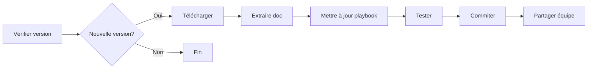

# 📝 Guide de Mise à Jour de la Documentation DSFR

## 🔄 Comment actualiser la documentation

### 1. Mise à jour depuis le site officiel DSFR

```bash
# Vérifier la dernière version disponible
curl -s https://www.systeme-de-design.gouv.fr/ | grep -o 'v[0-9]\.[0-9]*'

# Version actuelle : v1.14
# Si nouvelle version disponible, mettre à jour la doc
```

### 2. Mise à jour depuis NPM

```bash
# Installer/mettre à jour le package DSFR
npm install @gouvfr/dsfr@latest

# Voir la version installée
npm list @gouvfr/dsfr
```

### 3. Extraction de la nouvelle documentation

Créer un script Python `update_dsfr_docs.py` :

```python
#!/usr/bin/env python3
import json
import requests
from datetime import datetime

def get_latest_dsfr_version():
    """Récupère la dernière version depuis NPM"""
    response = requests.get('https://registry.npmjs.org/@gouvfr/dsfr')
    data = response.json()
    return data['dist-tags']['latest']

def extract_components():
    """Extrait les composants de la documentation"""
    # À implémenter selon la structure de la nouvelle version
    pass

def update_playbook():
    """Met à jour le playbook local"""
    version = get_latest_dsfr_version()
    print(f"Mise à jour vers DSFR {version}")
    
    # Extraction et mise à jour
    # ...
    
    # Sauvegarder avec timestamp
    timestamp = datetime.now().strftime('%Y%m%d')
    output_file = f"DSFR_{version}_PLAYBOOK_{timestamp}.md"
    
    print(f"✅ Documentation mise à jour : {output_file}")

if __name__ == "__main__":
    update_playbook()
```

### 4. Méthode manuelle simple

1. **Aller sur le site DSFR**
   ```
   https://www.systeme-de-design.gouv.fr/
   ```

2. **Vérifier les changements**
   - Nouveaux composants
   - Propriétés modifiées
   - Nouvelles variantes

3. **Mettre à jour le fichier**
   ```bash
   # Éditer le playbook
   nano docs/DSFR_v1.14_PLAYBOOK_ULTRA_COMPLET.md
   
   # Ajouter les nouveaux composants
   # Mettre à jour les propriétés
   ```

### 5. Script Bash d'actualisation

Créer `update_docs.sh` :

```bash
#!/bin/bash

echo "🔄 Mise à jour de la documentation DSFR..."

# 1. Vérifier la version NPM
LATEST=$(npm view @gouvfr/dsfr version)
echo "Dernière version NPM : $LATEST"

# 2. Télécharger si nouvelle version
CURRENT="1.14.0"
if [ "$LATEST" != "$CURRENT" ]; then
    echo "Nouvelle version disponible !"
    
    # Installer la nouvelle version
    npm install @gouvfr/dsfr@$LATEST
    
    # Extraire la doc
    python3 extract_npm_documentation.py
    
    echo "✅ Mise à jour terminée"
else
    echo "Documentation déjà à jour"
fi
```

### 6. Sources à surveiller

| Source | URL | Fréquence |
|--------|-----|-----------|
| Site officiel | https://www.systeme-de-design.gouv.fr/ | Mensuel |
| NPM | https://www.npmjs.com/package/@gouvfr/dsfr | Hebdomadaire |
| GitHub | https://github.com/GouvernementFR/dsfr | Quotidien (si critique) |
| Changelog | https://github.com/GouvernementFR/dsfr/releases | À chaque release |

### 7. Workflow de mise à jour recommandé



### 8. Commandes rapides

```bash
# Voir version actuelle dans le playbook
grep "DSFR v" docs/*.md | head -1

# Comparer avec NPM
npm view @gouvfr/dsfr version

# Voir les changements récents
curl -s https://api.github.com/repos/GouvernementFR/dsfr/releases/latest | jq '.body'

# Mettre à jour
./update_docs.sh
```

### 9. Structure à maintenir

```
mcp-playbook-dsfr/
├── docs/
│   └── DSFR_vX.XX_PLAYBOOK_ULTRA_COMPLET.md  # Mettre à jour ce fichier
├── update_docs.sh                              # Script de mise à jour
├── UPDATE_DOCS.md                              # Ce guide
└── package.json                                # Version NPM
```

### 10. Automatisation avec GitHub Actions

Créer `.github/workflows/update-dsfr.yml` :

```yaml
name: Update DSFR Documentation

on:
  schedule:
    - cron: '0 0 * * MON'  # Chaque lundi
  workflow_dispatch:

jobs:
  update:
    runs-on: ubuntu-latest
    steps:
      - uses: actions/checkout@v3
      - uses: actions/setup-node@v3
      - name: Check for updates
        run: |
          npm view @gouvfr/dsfr version
          ./update_docs.sh
      - name: Create PR if changes
        uses: peter-evans/create-pull-request@v5
        with:
          title: 'Mise à jour DSFR Documentation'
          body: 'Mise à jour automatique de la documentation DSFR'
```

## 📝 Notes importantes

- Toujours garder une copie de l'ancienne version avant mise à jour
- Tester les changements avant de partager avec l'équipe
- Documenter les breaking changes s'il y en a
- La doc actuelle est DSFR v1.14

## ⚡ Mise à jour rapide

Pour une mise à jour rapide :

1. `npm view @gouvfr/dsfr version` - Vérifier la version
2. Si nouvelle : `npm install @gouvfr/dsfr@latest`
3. Extraire et mettre à jour la doc
4. Tester avec `./dsfr-agent`