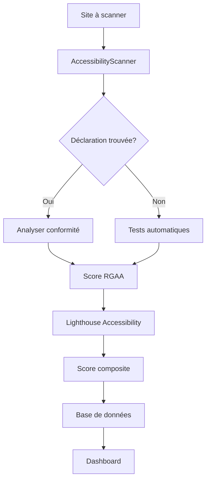

# Gestion de l'Accessibilité et Conformité RGAA dans Ecosystème

## 🎯 Vue d'ensemble

Le projet Ecosystème intègre une approche **multi-niveaux** pour garantir l'accessibilité web selon les standards RGAA (Référentiel Général d'Amélioration de l'Accessibilité) et WCAG 2.1.

## 📊 Architecture de l'accessibilité

### 1. Scanner d'accessibilité dédié (`accessibility-scanner.js`)

Un scanner automatisé qui analyse chaque site pour :
- **Détecter les déclarations d'accessibilité** (conformité RGAA)
- **Effectuer des vérifications de base** (images, formulaires, liens, etc.)
- **Calculer un score d'accessibilité** (0-100%)
- **Générer des recommandations** personnalisées

### 2. Intégration Lighthouse

Le scanner Lighthouse inclut un module d'accessibilité qui :
- Utilise **axe-core** (moteur de test d'accessibilité)
- Génère un score d'accessibilité (0-100)
- Identifie les problèmes critiques
- Propose des corrections détaillées

### 3. Base de données

Tables dédiées pour stocker :
- `declaration_accessibilite_presente` : Booléen
- `date_declaration_accessibilite` : Date de la déclaration
- `score_rgaa` : Score de conformité (0-100)
- `lighthouse_accessibility_score` : Score Lighthouse

## 🛠️ Outils et scanners d'accessibilité

### Scanner principal : `AccessibilityScanner`

#### Fonctionnalités détaillées

##### 1. Détection de déclaration RGAA
```javascript
// Recherche des mentions de conformité
- "Accessibilité : non conforme"
- "Accessibilité : partiellement conforme"  
- "Accessibilité : totalement conforme"

// Analyse fuzzy pour détecter les variantes
- Recherche approximative si texte exact non trouvé
- Détection des liens vers /accessibilite
```

##### 2. Vérifications automatiques

| Catégorie | Vérifications | Scoring |
|-----------|--------------|---------|
| **Images** | - Présence d'attribut `alt`<br>- Images décoratives (`role="presentation"`)<br>- Alt vides pour décoration | 0-100% basé sur couverture |
| **Titres** | - Hiérarchie H1-H6<br>- Un seul H1 par page<br>- Pas de titres vides | -20 points par problème |
| **Formulaires** | - Labels associés (`<label for>`)<br>- `aria-label` ou `aria-labelledby`<br>- Tous les champs identifiés | % de champs labellisés |
| **Liens** | - Texte de lien présent<br>- `aria-label` si pas de texte<br>- Pas de liens vides | % de liens accessibles |
| **Langue** | - Attribut `lang` sur `<html>`<br>- Langue valide (fr, en, etc.) | 100% ou 0% |
| **Navigation** | - Liens d'évitement ("Aller au contenu")<br>- Skip links détectés | 100% si présent |

##### 3. Score d'accessibilité composite
```javascript
calculateBasicAccessibilityScore(checks) {
  const scores = [
    checks.images.score,
    checks.headings.score,
    checks.forms.score,
    checks.links.score,
    checks.language.score,
    checks.skipLinks.score ? 100 : 50
  ];
  return Math.round(scores.reduce((a,b) => a+b) / scores.length);
}
```

### Intégration Lighthouse Accessibility

- **Moteur** : axe-core v4.10.3
- **Score** : 0-100 (converti depuis 0-1)
- **Audits** : 50+ tests automatiques WCAG 2.1
- **Stockage** : `lighthouse_accessibility_score` en base

### Monitoring et tableaux de bord

#### Métriques suivies
- Nombre de sites avec déclaration d'accessibilité
- Score moyen d'accessibilité RGAA
- Evolution dans le temps (historique)
- Sites non conformes nécessitant action

## 🎨 Accessibilité Frontend (DSFR)

### Composants DSFR accessibles par défaut

Tous les composants du Design System Français respectent :
- **RGAA 4.1** niveau AA minimum
- **WCAG 2.1** niveau AA
- **WAI-ARIA 1.1** pour les composants interactifs

### Attributs ARIA utilisés

| Attribut | Utilisation | Exemple dans le code |
|----------|------------|---------------------|
| `aria-hidden` | Masquer les éléments décoratifs | `<span aria-hidden="true">` pour icônes |
| `aria-label` | Étiqueter les éléments sans texte | Boutons avec icônes uniquement |
| `aria-labelledby` | Référencer un label existant | Formulaires complexes |
| `role` | Définir le rôle sémantique | `role="search"` pour recherche |
| `tabIndex` | Ordre de navigation clavier | Navigation personnalisée |

### Classes d'accessibilité

```css
.sr-only {
  /* Classe pour screen readers uniquement */
  position: absolute;
  width: 1px;
  height: 1px;
  padding: 0;
  margin: -1px;
  overflow: hidden;
  clip: rect(0,0,0,0);
  white-space: nowrap;
  border: 0;
}
```

## 📈 Statistiques d'accessibilité actuelles

### Couverture du code
- **27 fichiers** avec attributs ARIA
- **100+ utilisations** d'aria-hidden
- **5 références** RGAA/WCAG dans le backend
- **Footer** avec mention "partially compliant"

### Points forts ✅
1. **Scanner dédié** pour détecter les déclarations RGAA
2. **Double vérification** : Scanner custom + Lighthouse
3. **DSFR intégré** garantissant l'accessibilité de base
4. **Attributs ARIA** correctement utilisés
5. **Skip links** et navigation clavier
6. **Langue déclarée** sur toutes les pages

### Améliorations possibles 🔄
1. Implémenter **axe-core directement** pour tests plus poussés
2. Ajouter **pa11y** pour tests de régression
3. Créer des **tests E2E d'accessibilité** avec Playwright
4. Générer des **rapports RGAA détaillés**
5. Ajouter un **mode haute contrast**
6. Implémenter **focus visible** personnalisé

## 🔍 Workflow de vérification



## 📋 Checklist RGAA implémentée

### Niveau A (Essentiel)
- ✅ Images avec alternatives textuelles
- ✅ Hiérarchie de titres correcte
- ✅ Formulaires avec labels
- ✅ Langue de la page déclarée
- ✅ Navigation au clavier possible

### Niveau AA (Recommandé)
- ✅ Contraste suffisant (via DSFR)
- ✅ Texte redimensionnable
- ✅ Pas de piège clavier
- ⚠️ Sous-titres vidéo (non vérifié)
- ⚠️ Audio-description (non vérifié)

### Niveau AAA (Optimal)
- ❌ Langue des sections
- ❌ Aide contextuelle
- ❌ Pas de limite de temps
- ❌ Contraste élevé (8.5:1)

## 🚀 Commandes et API

### Scanner un site pour l'accessibilité
```bash
POST /api/scan/accessibility
{
  "url": "https://site.gouv.fr"
}
```

### Récupérer les stats d'accessibilité
```bash
GET /api/sites/stats
# Retourne sites_avec_declaration_accessibilite, moyenne_accessibilite
```

### Lighthouse avec module accessibilité
```bash
POST /api/scan/lighthouse
# Inclut automatiquement le score d'accessibilité
```

## 📊 Métriques clés surveillées

1. **Taux de conformité** : % sites avec déclaration
2. **Score moyen** : Moyenne des scores RGAA
3. **Évolution** : Progression mensuelle
4. **Top problèmes** : Issues les plus fréquentes
5. **Sites critiques** : Score < 50%

## 🎓 Ressources et standards

### Référentiels suivis
- [RGAA 4.1](https://www.numerique.gouv.fr/publications/rgaa-accessibilite/)
- [WCAG 2.1 Level AA](https://www.w3.org/WAI/WCAG21/quickref/)
- [WAI-ARIA 1.1](https://www.w3.org/WAI/standards-guidelines/aria/)
- [DSFR Accessibilité](https://www.systeme-de-design.gouv.fr/elements-d-interface/fondamentaux-techniques/accessibilite)

### Outils de test recommandés
- **axe DevTools** : Extension navigateur
- **WAVE** : Web Accessibility Evaluation Tool
- **NVDA/JAWS** : Screen readers pour tests manuels
- **Contrast Checker** : Vérification des contrastes

---

*Document généré le 11 septembre 2025*  
*Conformité visée : RGAA 4.1 niveau AA*