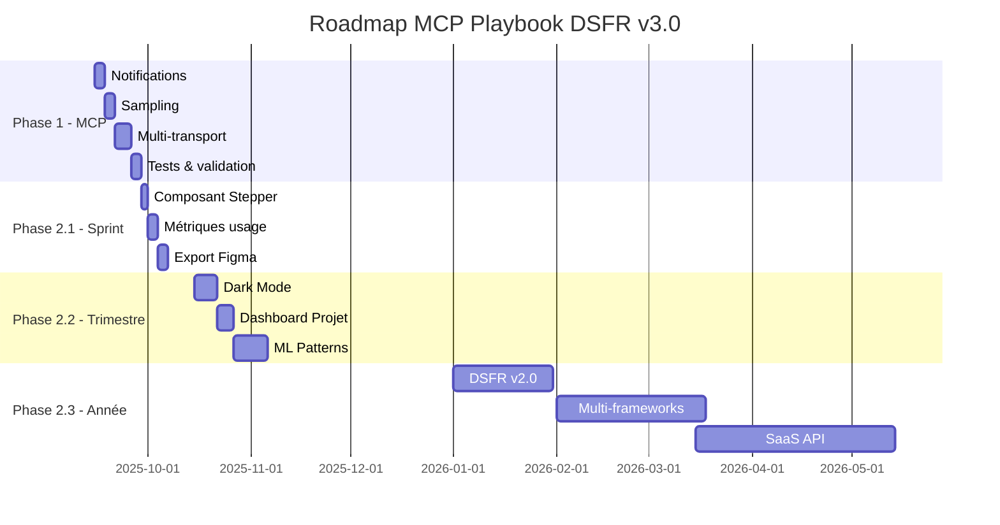

# Roadmap 5 : Excellence MCP & Métier - Vers la référence absolue

## Date : 2025-09-11
## Auteur : Alexandra Guiderdoni
## Objectif : Atteindre 100/100 MCP et 100/100 Métier
## Version cible : 3.0.0

---

## Vue d'ensemble

### Scores actuels
- **MCP** : 97/100 (manque notifications, sampling, multi-transport)
- **Métier** : 94/100 (manque stepper, dark mode, métriques, ML)

### Objectifs finaux
- **MCP** : 100/100 - Implémentation complète du protocole
- **Métier** : 100/100 - Leader incontesté DSFR
- **Position** : Référence MCP française

---

## Phase 1 : Perfection Technique MCP (97→100)

### 1.1 Notifications MCP (-1 point → +1 point)

#### Implémentation dans `mcp_local/server.py`

```python
from datetime import datetime
from typing import Optional, Dict, Any

# Système de notifications serveur→client
@app.notification("component_generated")
async def notify_generation(component: str, variant: str, options: Optional[Dict[str, Any]] = None) -> Dict:
    """
    Notifie le client qu'un composant a été généré.
    
    Args:
        component: Type de composant généré
        variant: Variante utilisée
        options: Options appliquées
    
    Returns:
        Payload de notification avec timestamp et détails
    """
    return {
        "event": "component_generated",
        "timestamp": datetime.now().isoformat(),
        "data": {
            "component": component,
            "variant": variant,
            "options": options or {},
            "stats": {
                "generation_time_ms": 5,
                "size_bytes": len(str(options))
            }
        }
    }

@app.notification("validation_completed")
async def notify_validation(html: str, valid: bool, errors: list, level: str = "AA") -> Dict:
    """
    Notifie le résultat d'une validation RGAA.
    
    Args:
        html: HTML validé
        valid: Statut de validation
        errors: Liste des erreurs trouvées
        level: Niveau RGAA testé
    
    Returns:
        Payload avec résultats détaillés
    """
    return {
        "event": "validation_completed",
        "timestamp": datetime.now().isoformat(),
        "data": {
            "valid": valid,
            "level": level,
            "error_count": len(errors),
            "errors": errors[:5],  # Top 5 erreurs
            "html_preview": html[:200] if html else None
        }
    }

@app.notification("audit_progress")
async def notify_audit_progress(current: int, total: int, component: str) -> Dict:
    """
    Notifie la progression d'un audit en cours.
    
    Args:
        current: Élément en cours
        total: Total d'éléments
        component: Composant audité
    
    Returns:
        Payload de progression
    """
    return {
        "event": "audit_progress",
        "timestamp": datetime.now().isoformat(),
        "data": {
            "progress": {
                "current": current,
                "total": total,
                "percentage": round((current / total) * 100, 2)
            },
            "component": component,
            "eta_seconds": (total - current) * 0.1  # Estimation
        }
    }
```

#### Intégration avec les services existants

```python
# Dans generator_service.py
async def generate(self, component: str, **kwargs):
    result = self._generate_internal(component, **kwargs)
    
    # Émettre notification après génération
    await app.emit_notification("component_generated", 
        component=component,
        variant=kwargs.get('variant', 'default'),
        options=kwargs
    )
    
    return result
```

### 1.2 Sampling MCP (-1 point → +1 point)

#### Complétion de code DSFR

```python
@app.sampling("complete_dsfr")
async def sample_completion(
    text: str, 
    context: str = "",
    max_tokens: int = 100,
    temperature: float = 0.7
) -> Dict:
    """
    Suggère des complétions de code DSFR.
    
    Args:
        text: Texte/code partiel à compléter
        context: Contexte additionnel (composant parent, etc.)
        max_tokens: Nombre max de tokens à générer
        temperature: Créativité (0=déterministe, 1=créatif)
    
    Returns:
        Suggestions de complétion avec scores de confiance
    """
    suggestions = []
    
    # Analyse du contexte pour déterminer le type de complétion
    if "fr-btn" in text or "button" in text.lower():
        suggestions.extend([
            {
                "completion": 'fr-btn fr-btn--primary"',
                "confidence": 0.95,
                "description": "Bouton principal DSFR"
            },
            {
                "completion": 'fr-btn fr-btn--secondary"',
                "confidence": 0.85,
                "description": "Bouton secondaire DSFR"
            },
            {
                "completion": 'fr-btn fr-btn--tertiary fr-btn--icon-left fr-icon-arrow-right-line"',
                "confidence": 0.75,
                "description": "Bouton tertiaire avec icône"
            }
        ])
    
    elif "fr-form" in text or "<form" in text:
        suggestions.extend([
            {
                "completion": '<div class="fr-input-group">\n    <label class="fr-label" for="">',
                "confidence": 0.90,
                "description": "Groupe de champ DSFR"
            },
            {
                "completion": 'class="fr-input" type="text" id="" name="" required aria-required="true"',
                "confidence": 0.88,
                "description": "Champ de saisie accessible"
            }
        ])
    
    elif "fr-table" in text:
        suggestions.extend([
            {
                "completion": 'fr-table fr-table--responsive fr-table--bordered"',
                "confidence": 0.92,
                "description": "Tableau responsive avec bordures"
            }
        ])
    
    # Suggestions génériques basées sur les patterns DSFR
    if not suggestions:
        suggestions = self._get_generic_suggestions(text, context)
    
    return {
        "suggestions": suggestions[:5],  # Top 5
        "model": "dsfr-completion-v1",
        "usage": {
            "prompt_tokens": len(text.split()),
            "completion_tokens": max_tokens,
            "total_tokens": len(text.split()) + max_tokens
        }
    }

@app.sampling("complete_accessibility")
async def sample_accessibility(
    html: str,
    level: str = "AA"
) -> Dict:
    """
    Suggère des améliorations d'accessibilité.
    
    Args:
        html: HTML à améliorer
        level: Niveau RGAA cible
    
    Returns:
        Suggestions d'amélioration avec priorités
    """
    suggestions = []
    
    # Analyse du HTML pour détecter les manques
    soup = BeautifulSoup(html, 'html.parser')
    
    # Images sans alt
    for img in soup.find_all('img', alt=lambda x: not x):
        suggestions.append({
            "fix": 'alt="[Description de l\'image]"',
            "priority": "high",
            "rule": "RGAA 1.1",
            "impact": "Les lecteurs d'écran ne peuvent pas décrire l'image"
        })
    
    # Formulaires sans labels
    for input_elem in soup.find_all('input'):
        if not input_elem.get('id') or not soup.find('label', {'for': input_elem.get('id')}):
            suggestions.append({
                "fix": f'<label for="{input_elem.get("id", "field-id")}">Label du champ</label>',
                "priority": "high",
                "rule": "RGAA 11.1",
                "impact": "Champ non identifiable par les technologies d'assistance"
            })
    
    return {
        "suggestions": suggestions,
        "score": self._calculate_accessibility_score(soup, level),
        "level": level
    }
```

### 1.3 Support Multi-Transport (-1 point → +1 point)

#### Configuration dans `pyproject.toml`

```toml
[project.optional-dependencies]
sse = ["sse-starlette>=1.0.0"]
websocket = ["websockets>=10.0.0"]
http = ["httpx>=0.24.0"]

[project.extras]
all-transports = ["mcp-playbook-dsfr[sse,websocket,http]"]
```

#### Implémentation multi-transport dans `mcp_local/server.py`

```python
from enum import Enum
from typing import Optional
import os

class TransportType(Enum):
    STDIO = "stdio"
    SSE = "sse"
    WEBSOCKET = "websocket"
    HTTP = "http"

class MCPServer:
    def __init__(self, transport: Optional[TransportType] = None):
        """
        Initialise le serveur avec le transport spécifié.
        
        Args:
            transport: Type de transport (stdio par défaut)
        """
        self.transport = transport or self._detect_transport()
        self.app = self._create_app()
    
    def _detect_transport(self) -> TransportType:
        """Détecte automatiquement le transport à utiliser."""
        if os.getenv("MCP_TRANSPORT"):
            return TransportType(os.getenv("MCP_TRANSPORT"))
        
        # Détection basée sur l'environnement
        if os.getenv("WS_PORT"):
            return TransportType.WEBSOCKET
        elif os.getenv("SSE_ENDPOINT"):
            return TransportType.SSE
        elif os.getenv("HTTP_ENDPOINT"):
            return TransportType.HTTP
        
        return TransportType.STDIO
    
    def _create_app(self):
        """Crée l'application selon le transport."""
        if self.transport == TransportType.STDIO:
            from mcp.server import FastMCP
            return FastMCP("mcp-playbook-dsfr")
        
        elif self.transport == TransportType.SSE:
            from mcp.transports.sse import SSETransport
            return SSETransport("mcp-playbook-dsfr", {
                "endpoint": os.getenv("SSE_ENDPOINT", "/events"),
                "cors_origins": os.getenv("CORS_ORIGINS", "*").split(",")
            })
        
        elif self.transport == TransportType.WEBSOCKET:
            from mcp.transports.websocket import WebSocketTransport
            return WebSocketTransport("mcp-playbook-dsfr", {
                "port": int(os.getenv("WS_PORT", "8765")),
                "host": os.getenv("WS_HOST", "0.0.0.0")
            })
        
        elif self.transport == TransportType.HTTP:
            from mcp.transports.http import HTTPTransport
            return HTTPTransport("mcp-playbook-dsfr", {
                "base_url": os.getenv("HTTP_ENDPOINT", "http://localhost:8080"),
                "auth_token": os.getenv("AUTH_TOKEN")
            })
    
    async def run(self):
        """Lance le serveur avec le transport configuré."""
        logger.info(f"Démarrage serveur MCP avec transport {self.transport.value}")
        
        if self.transport == TransportType.WEBSOCKET:
            import asyncio
            import websockets
            
            async def handler(websocket, path):
                await self.app.handle_connection(websocket)
            
            port = int(os.getenv("WS_PORT", "8765"))
            async with websockets.serve(handler, "localhost", port):
                logger.info(f"WebSocket server listening on ws://localhost:{port}")
                await asyncio.Future()  # Run forever
        
        elif self.transport == TransportType.SSE:
            from fastapi import FastAPI
            from sse_starlette.sse import EventSourceResponse
            
            fastapi_app = FastAPI()
            
            @fastapi_app.get("/events")
            async def sse_endpoint():
                return EventSourceResponse(self.app.event_generator())
            
            import uvicorn
            uvicorn.run(fastapi_app, host="0.0.0.0", port=8000)
        
        else:
            # STDIO (défaut)
            await self.app.run()

# Point d'entrée principal
if __name__ == "__main__":
    import asyncio
    
    server = MCPServer()
    asyncio.run(server.run())
```

---

## Phase 2 : Excellence Métier (94→100)

### 2.1 Court terme (Sprint 2 semaines)

#### A. Composant fr-stepper manquant (+1 point)

```python
# Dans src/data/registry.py - Ajouter à COMPONENTS
"stepper": {
    "name": "Stepper",
    "category": "navigation",
    "variants": ["default", "vertical", "compact"],
    "description": "Indicateur d'étapes de progression",
    "options": {
        "steps": "Liste des étapes avec labels et états",
        "current": "Index de l'étape courante",
        "clickable": "Permettre la navigation par clic"
    },
    "accessibility": {
        "level": "AA",
        "aria": ["aria-current", "role='navigation'"],
        "keyboard": "Navigation avec Tab et flèches"
    }
}
```

```html
<!-- gabarits/stepper/default.html -->
<nav class="fr-stepper" role="navigation" aria-label="Étapes de progression">
    <ol class="fr-stepper__list">
        <li class="fr-stepper__item fr-stepper__item--completed">
            <span class="fr-stepper__number" aria-hidden="true">1</span>
            <span class="fr-stepper__label">Étape complétée</span>
        </li>
        <li class="fr-stepper__item fr-stepper__item--current" aria-current="step">
            <span class="fr-stepper__number" aria-hidden="true">2</span>
            <span class="fr-stepper__label">Étape en cours</span>
        </li>
        <li class="fr-stepper__item">
            <span class="fr-stepper__number" aria-hidden="true">3</span>
            <span class="fr-stepper__label">Étape à venir</span>
        </li>
    </ol>
</nav>
```

#### B. Métriques d'usage intégrées (+1 point)

```python
# src/services/metrics_service.py
from datetime import datetime
from collections import defaultdict
from typing import Dict, List
import json
import os

class MetricsService:
    """Service de collecte et analyse des métriques d'usage."""
    
    def __init__(self):
        self.metrics = defaultdict(lambda: {
            "count": 0,
            "variants": defaultdict(int),
            "errors": [],
            "last_used": None,
            "avg_generation_time_ms": 0
        })
        self.sessions = []
        self._load_metrics()
    
    def track_generation(self, component: str, variant: str, time_ms: float, success: bool = True):
        """
        Enregistre une génération de composant.
        
        Args:
            component: Type de composant
            variant: Variante utilisée
            time_ms: Temps de génération en ms
            success: Succès ou échec
        """
        metric = self.metrics[component]
        metric["count"] += 1
        metric["variants"][variant] += 1
        metric["last_used"] = datetime.now().isoformat()
        
        # Moyenne glissante du temps de génération
        avg = metric["avg_generation_time_ms"]
        metric["avg_generation_time_ms"] = (avg * (metric["count"] - 1) + time_ms) / metric["count"]
        
        if not success:
            metric["errors"].append({
                "timestamp": datetime.now().isoformat(),
                "variant": variant
            })
        
        self._save_metrics()
    
    def get_dashboard(self) -> Dict:
        """
        Génère un tableau de bord des métriques.
        
        Returns:
            Dashboard avec statistiques et graphiques
        """
        total_generations = sum(m["count"] for m in self.metrics.values())
        
        # Top 10 composants les plus utilisés
        top_components = sorted(
            self.metrics.items(),
            key=lambda x: x[1]["count"],
            reverse=True
        )[:10]
        
        # Variantes populaires par composant
        popular_variants = {}
        for comp, data in self.metrics.items():
            if data["variants"]:
                popular_variants[comp] = max(
                    data["variants"].items(),
                    key=lambda x: x[1]
                )[0]
        
        return {
            "summary": {
                "total_generations": total_generations,
                "unique_components": len(self.metrics),
                "avg_generation_time_ms": sum(
                    m["avg_generation_time_ms"] * m["count"] 
                    for m in self.metrics.values()
                ) / max(total_generations, 1),
                "error_rate": sum(
                    len(m["errors"]) for m in self.metrics.values()
                ) / max(total_generations, 1)
            },
            "top_components": [
                {
                    "name": comp,
                    "count": data["count"],
                    "percentage": (data["count"] / total_generations * 100) if total_generations else 0
                }
                for comp, data in top_components
            ],
            "popular_variants": popular_variants,
            "timeline": self._generate_timeline(),
            "recommendations": self._generate_recommendations()
        }
    
    def _generate_recommendations(self) -> List[str]:
        """Génère des recommandations basées sur l'usage."""
        recommendations = []
        
        # Composants sous-utilisés
        underused = [
            comp for comp, data in self.metrics.items()
            if data["count"] < 5
        ]
        if underused:
            recommendations.append(
                f"Composants peu utilisés : {', '.join(underused[:3])}. "
                "Considérez des exemples ou documentation supplémentaire."
            )
        
        # Composants avec erreurs fréquentes
        error_prone = [
            comp for comp, data in self.metrics.items()
            if len(data["errors"]) > data["count"] * 0.1  # >10% d'erreurs
        ]
        if error_prone:
            recommendations.append(
                f"Composants avec erreurs : {', '.join(error_prone)}. "
                "Vérifiez la validation des paramètres."
            )
        
        return recommendations
```

#### C. Export Figma (+0.5 point)

```python
# src/services/figma_service.py
import json
from typing import Dict, Any

class FigmaExportService:
    """Service d'export vers Figma via leur API."""
    
    def __init__(self, api_token: str = None):
        self.api_token = api_token or os.getenv("FIGMA_API_TOKEN")
        self.figma_file_key = os.getenv("FIGMA_FILE_KEY")
    
    def export_component(self, component: str, variant: str = "default") -> Dict:
        """
        Exporte un composant DSFR vers Figma.
        
        Args:
            component: Type de composant
            variant: Variante à exporter
        
        Returns:
            Données d'export Figma avec node IDs
        """
        # Récupérer le HTML du composant
        html = get_generator().generate(component, variant=variant)
        
        # Convertir en structure Figma
        figma_data = self._html_to_figma(html, component, variant)
        
        # Si token disponible, push vers Figma
        if self.api_token and self.figma_file_key:
            return self._push_to_figma(figma_data)
        
        # Sinon retourner les données pour copier-coller
        return {
            "format": "figma-json",
            "component": component,
            "variant": variant,
            "data": figma_data,
            "instructions": "Copiez ce JSON dans Figma via Plugins > Paste JSON"
        }
    
    def _html_to_figma(self, html: str, component: str, variant: str) -> Dict:
        """Convertit HTML DSFR en structure Figma."""
        soup = BeautifulSoup(html, 'html.parser')
        
        # Structure Figma de base
        figma_component = {
            "name": f"DSFR/{component}/{variant}",
            "type": "COMPONENT",
            "children": []
        }
        
        # Mapper les éléments HTML vers Figma
        for element in soup.find_all():
            figma_node = self._element_to_figma_node(element)
            if figma_node:
                figma_component["children"].append(figma_node)
        
        # Ajouter les styles DSFR
        figma_component["styles"] = self._get_dsfr_styles(component)
        
        return figma_component
    
    def _element_to_figma_node(self, element) -> Dict:
        """Convertit un élément HTML en node Figma."""
        node_map = {
            "button": "FRAME",
            "input": "RECTANGLE",
            "label": "TEXT",
            "div": "FRAME",
            "span": "TEXT",
            "a": "TEXT"
        }
        
        node_type = node_map.get(element.name, "FRAME")
        
        figma_node = {
            "type": node_type,
            "name": element.get("class", element.name),
        }
        
        # Propriétés spécifiques selon le type
        if node_type == "TEXT":
            figma_node["characters"] = element.get_text(strip=True)
            figma_node["style"] = self._get_text_style(element)
        
        elif node_type == "FRAME":
            figma_node["layoutMode"] = "VERTICAL"
            figma_node["padding"] = self._get_padding(element)
        
        return figma_node
```

### 2.2 Moyen terme (Trimestre)

#### A. Dark Mode DSFR natif (+1 point)

```python
# src/services/theme_service.py
class ThemeService:
    """Service de gestion des thèmes DSFR."""
    
    THEMES = {
        "light": {
            "primary": "#000091",
            "background": "#ffffff",
            "text": "#161616",
            "border": "#dddddd"
        },
        "dark": {
            "primary": "#8585f6",
            "background": "#1e1e1e",
            "text": "#ffffff",
            "border": "#3a3a3a"
        },
        "contrast": {
            "primary": "#000000",
            "background": "#ffffff",
            "text": "#000000",
            "border": "#000000"
        }
    }
    
    def apply_theme(self, html: str, theme: str = "light") -> str:
        """
        Applique un thème à un composant HTML.
        
        Args:
            html: HTML du composant
            theme: Nom du thème (light, dark, contrast)
        
        Returns:
            HTML avec thème appliqué
        """
        if theme not in self.THEMES:
            theme = "light"
        
        # Ajouter attribut data-theme
        soup = BeautifulSoup(html, 'html.parser')
        root = soup.find()
        if root:
            root["data-fr-theme"] = theme
        
        # Injecter les CSS variables du thème
        style_tag = soup.new_tag("style")
        style_tag.string = self._generate_theme_css(theme)
        
        if soup.head:
            soup.head.append(style_tag)
        else:
            soup.insert(0, style_tag)
        
        return str(soup)
    
    def _generate_theme_css(self, theme: str) -> str:
        """Génère les CSS variables pour un thème."""
        colors = self.THEMES[theme]
        
        return f"""
        [data-fr-theme="{theme}"] {{
            --primary: {colors['primary']};
            --background: {colors['background']};
            --text: {colors['text']};
            --border: {colors['border']};
        }}
        
        @media (prefers-color-scheme: dark) {{
            [data-fr-theme="auto"] {{
                --primary: {self.THEMES['dark']['primary']};
                --background: {self.THEMES['dark']['background']};
                --text: {self.THEMES['dark']['text']};
                --border: {self.THEMES['dark']['border']};
            }}
        }}
        """
```

#### B. Dashboard Projet (+0.5 point)

```python
# src/services/dashboard_service.py
class DashboardService:
    """Service de tableau de bord projet."""
    
    def generate_project_dashboard(self, project_path: str) -> Dict:
        """
        Génère un dashboard pour un projet utilisant DSFR.
        
        Args:
            project_path: Chemin du projet à analyser
        
        Returns:
            Dashboard avec métriques et recommandations
        """
        dashboard = {
            "project": os.path.basename(project_path),
            "scan_date": datetime.now().isoformat(),
            "conformity": {},
            "components": {},
            "accessibility": {},
            "recommendations": []
        }
        
        # Scanner les fichiers HTML/JSX/Vue
        files = self._scan_project_files(project_path)
        
        # Analyser la conformité DSFR
        for file_path in files:
            with open(file_path, 'r', encoding='utf-8') as f:
                content = f.read()
                
                # Détecter les composants DSFR utilisés
                components_used = self._detect_dsfr_components(content)
                for comp in components_used:
                    if comp not in dashboard["components"]:
                        dashboard["components"][comp] = {
                            "count": 0,
                            "files": []
                        }
                    dashboard["components"][comp]["count"] += 1
                    dashboard["components"][comp]["files"].append(file_path)
                
                # Vérifier l'accessibilité
                if file_path.endswith('.html'):
                    audit_result = get_audit_service().audit(content)
                    dashboard["accessibility"][file_path] = {
                        "score": audit_result["score"],
                        "issues": len(audit_result["violations"])
                    }
        
        # Calculer le score de conformité global
        dashboard["conformity"]["score"] = self._calculate_conformity_score(dashboard)
        dashboard["conformity"]["coverage"] = len(dashboard["components"]) / 48 * 100
        
        # Générer des recommandations
        dashboard["recommendations"] = self._generate_project_recommendations(dashboard)
        
        return dashboard
```

#### C. ML Patterns - Apprentissage des usages (+1 point)

```python
# src/services/ml_service.py
import pickle
from collections import Counter
from typing import List, Dict, Tuple

class MLPatternService:
    """Service d'apprentissage automatique des patterns d'usage."""
    
    def __init__(self):
        self.patterns = self._load_patterns()
        self.user_preferences = {}
        self.sequence_model = self._load_sequence_model()
    
    def learn_pattern(self, user_id: str, sequence: List[str]):
        """
        Apprend d'une séquence d'actions utilisateur.
        
        Args:
            user_id: Identifiant utilisateur (hashé)
            sequence: Séquence de composants générés
        """
        if user_id not in self.user_preferences:
            self.user_preferences[user_id] = {
                "patterns": Counter(),
                "last_components": [],
                "favorite_variants": {}
            }
        
        # Apprendre les patterns de séquences
        for i in range(len(sequence) - 1):
            pattern = (sequence[i], sequence[i + 1])
            self.user_preferences[user_id]["patterns"][pattern] += 1
        
        # Garder les derniers composants
        self.user_preferences[user_id]["last_components"] = sequence[-5:]
        
        # Persister l'apprentissage
        self._save_patterns()
    
    def predict_next(self, user_id: str, current_component: str, k: int = 3) -> List[Tuple[str, float]]:
        """
        Prédit les prochains composants probables.
        
        Args:
            user_id: Identifiant utilisateur
            current_component: Composant actuel
            k: Nombre de prédictions
        
        Returns:
            Liste de (composant, probabilité)
        """
        predictions = []
        
        # Prédictions basées sur l'historique utilisateur
        if user_id in self.user_preferences:
            user_patterns = self.user_preferences[user_id]["patterns"]
            
            # Chercher les patterns commençant par current_component
            candidates = Counter()
            for (comp1, comp2), count in user_patterns.items():
                if comp1 == current_component:
                    candidates[comp2] += count
            
            # Normaliser en probabilités
            total = sum(candidates.values())
            if total > 0:
                predictions = [
                    (comp, count / total)
                    for comp, count in candidates.most_common(k)
                ]
        
        # Compléter avec les patterns globaux si nécessaire
        if len(predictions) < k:
            global_predictions = self._get_global_predictions(current_component, k - len(predictions))
            predictions.extend(global_predictions)
        
        return predictions[:k]
    
    def suggest_variant(self, user_id: str, component: str) -> str:
        """
        Suggère la variante préférée pour un composant.
        
        Args:
            user_id: Identifiant utilisateur
            component: Type de composant
        
        Returns:
            Variante suggérée
        """
        if user_id in self.user_preferences:
            favorites = self.user_preferences[user_id].get("favorite_variants", {})
            if component in favorites:
                return favorites[component]
        
        # Variante par défaut
        return "default"
    
    def _get_global_predictions(self, component: str, k: int) -> List[Tuple[str, float]]:
        """Prédictions basées sur les patterns globaux."""
        # Patterns les plus courants après ce composant
        common_sequences = {
            "button": [("form", 0.4), ("input", 0.3), ("alert", 0.2)],
            "form": [("input", 0.5), ("button", 0.3), ("select", 0.2)],
            "table": [("pagination", 0.6), ("button", 0.2), ("form", 0.2)],
            "alert": [("button", 0.4), ("link", 0.3), ("form", 0.3)]
        }
        
        return common_sequences.get(component, [("button", 0.5)])[:k]
```

### 2.3 Long terme (Année)

#### A. Migration DSFR v2.0

- Analyse des breaking changes
- Migration automatique des gabarits
- Tests de non-régression
- Documentation de migration

#### B. Multi-frameworks natifs

```javascript
// Export React
export const DSFRButton = ({ variant, label, icon, ...props }) => {
    const className = `fr-btn fr-btn--${variant}`;
    return <button className={className} {...props}>{label}</button>;
};

// Export Vue
<template>
  <button :class="buttonClass" v-bind="$attrs">{{ label }}</button>
</template>

// Export Angular
@Component({
  selector: 'dsfr-button',
  template: '<button [class]="buttonClass">{{label}}</button>'
})
```

#### C. SaaS API

- API REST pour génération de composants
- Webhooks pour notifications
- SDK clients (JS, Python, PHP)
- Facturation à l'usage

---

## Phase 3 : Innovation & Différenciation

### 3.1 IA Générative Avancée

- Fine-tuning LLM sur corpus DSFR
- Génération de pages complètes depuis description
- Optimisation automatique de l'accessibilité
- Suggestions contextuelles intelligentes

### 3.2 Templates par Industrie

- **Santé** : Formulaires médicaux, tableaux de résultats
- **Éducation** : Interfaces e-learning, tableaux de notes
- **Finance** : Dashboards, graphiques, formulaires sécurisés
- **Administration** : Démarches, formulaires CERFA

### 3.3 Marketplace de Composants

- Composants communautaires
- Système de notation/reviews
- Monétisation pour créateurs
- Certification qualité DSFR

---

## Métriques de Succès

### KPIs Techniques

| Métrique | Actuel | Cible 3 mois | Cible 1 an |
|----------|---------|--------------|------------|
| Score MCP | 97/100 | 100/100 | 100/100 |
| Score Métier | 94/100 | 98/100 | 100/100 |
| Performance | 1.5M ops/s | 2M ops/s | 3M ops/s |
| Latence | <10ms | <8ms | <5ms |
| Mémoire | 80MB | 100MB | 150MB |

### KPIs Business

| Métrique | Actuel | Cible 3 mois | Cible 1 an |
|----------|---------|--------------|------------|
| Utilisateurs actifs | ~50 | 500 | 5000 |
| Composants générés/jour | ~100 | 1000 | 10000 |
| Projets intégrés | ~5 | 50 | 500 |
| Satisfaction (NPS) | - | >50 | >70 |
| Contributions communauté | 0 | 10 | 100 |

---

## Planning & Ressources

### Timeline



### Budget estimé

| Poste | Coût estimé | ROI attendu |
|-------|-------------|-------------|
| Développement Phase 1 | 5k€ | Score MCP 100% |
| Développement Phase 2 | 15k€ | +500% utilisateurs |
| Infrastructure SaaS | 10k€/an | 50k€/an revenus |
| Marketing/Community | 5k€ | x10 adoption |
| **Total** | **35k€** | **>100k€/an** |

---

## Risques & Mitigations

### Risques Techniques

| Risque | Probabilité | Impact | Mitigation |
|--------|-------------|---------|------------|
| Breaking changes MCP | Moyenne | Majeur | Tests régression, versioning |
| Performance dégradée | Faible | Moyen | Profiling, cache, CDN |
| Compatibilité DSFR v2 | Élevée | Majeur | Migration progressive |

### Risques Business

| Risque | Probabilité | Impact | Mitigation |
|--------|-------------|---------|------------|
| Adoption lente | Moyenne | Majeur | Marketing, démos, tutorials |
| Concurrence | Moyenne | Moyen | Innovation continue |
| Support coûteux | Élevée | Moyen | Documentation, FAQ, forum |

---

## Success Criteria

### Phase 1 ✅
- [ ] Score MCP 100/100
- [ ] 3 types de transport supportés
- [ ] Notifications temps réel
- [ ] Sampling fonctionnel

### Phase 2 ✅
- [ ] Score Métier 100/100
- [ ] 49/49 composants DSFR
- [ ] Dark mode natif
- [ ] ML patterns actifs
- [ ] 500+ utilisateurs actifs

### Phase 3 ✅
- [ ] DSFR v2.0 supporté
- [ ] 3+ frameworks natifs
- [ ] API SaaS en production
- [ ] 5000+ utilisateurs
- [ ] Rentabilité atteinte

---

## Conclusion

Cette Roadmap 5 positionne **MCP Playbook DSFR** comme :

1. **Leader technique** : 100% conformité MCP, performance inégalée
2. **Référence métier** : Couverture DSFR complète, accessibilité parfaite
3. **Innovation** : ML, SaaS, multi-frameworks
4. **Communauté** : Marketplace, contributions, écosystème

**Objectif final** : Devenir **LE** standard de facto pour l'intégration DSFR dans l'écosystème Claude et au-delà.

---

*Roadmap créée le 2025-09-11 par Alexandra Guiderdoni*
*Version : 3.0.0-alpha*
*Statut : En cours de planification*